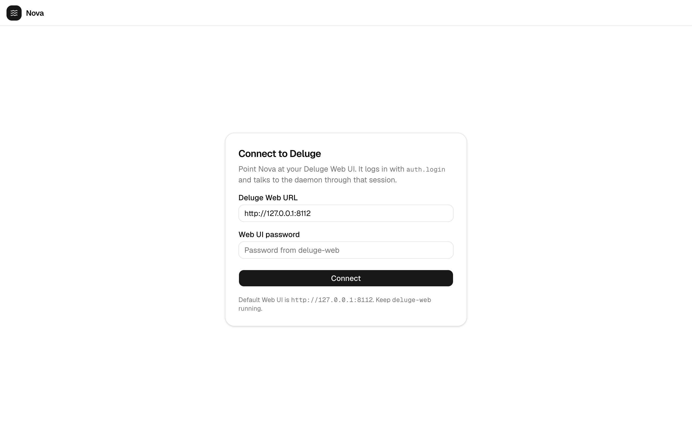
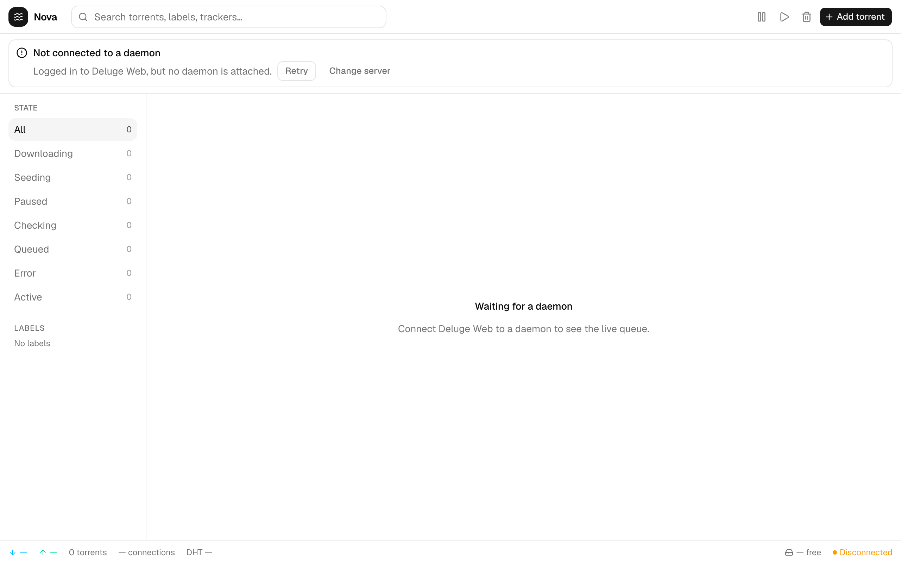

# Deluge Nova

A modern web UI for [Deluge](https://deluge-torrent.org/). It sits in front of `deluge-web`, logs in with your Web UI password, and drives the live daemon queue — not a sample list.

<p align="center">
  
</p>

## What it does

- **Connect to your daemon** — Deluge Web URL + Web UI password (`auth.login`)
- **See the live queue** — name, size, progress, download/upload rates, ETA, ratio, and seeds
- **Filter and search** — jump by state or label, find torrents by name, label, or tracker
- **Inspect a torrent** — transferred bytes, tracker, save path, files, and peers
- **Add torrents** — paste a magnet or drop a `.torrent` file
- **Pause, resume, remove** — selected torrents go through Deluge JSON-RPC
- **Watch the session** — combined rates, connections, DHT, free disk, and daemon status

Empty and disconnected states are real. If you are not logged in, Nova shows the connect screen. If the queue is empty, it stays empty.

## Screenshots

### Empty queue

After a successful login, the dashboard chrome with no torrents.

<p align="center">
  
</p>

### Disconnected

Logged in to Deluge Web, but no daemon is attached yet.

<p align="center">
  
</p>

### Add torrent

Magnets, torrent files, and a download location sent to your daemon.

<p align="center">
  
</p>

## Run it

```bash
npm install
npm run dev
```

Open [http://localhost:3000](http://localhost:3000). For a production build:

```bash
npm run build
npm start
```

## Point it at Deluge

1. Keep **deluge-web** running (default `http://127.0.0.1:8112`).
2. Open Nova and enter that Web UI URL plus the Web UI password.
3. Nova proxies JSON-RPC to `{url}/json` and torrent uploads to `{url}/upload`, then calls `web.update_ui`, add/pause/resume/remove on the daemon.

The URL is stored in the browser (`localStorage`). The password is not. Session cookies from Deluge Web stay on localhost and are forwarded by the Next.js routes.

Optional server default if you always use the same host:

```bash
DELUGE_WEB_URL=http://127.0.0.1:8112 npm run dev
```

You still sign in with the Web UI password on first visit.

## License

[GPL-3.0](LICENSE)
