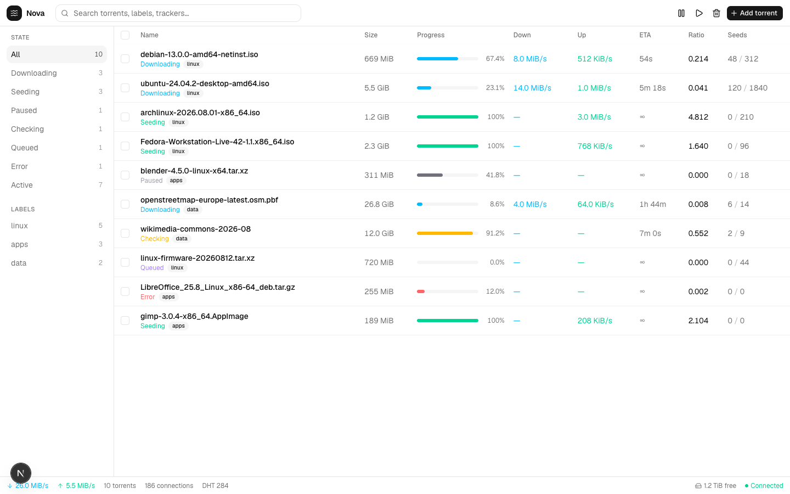
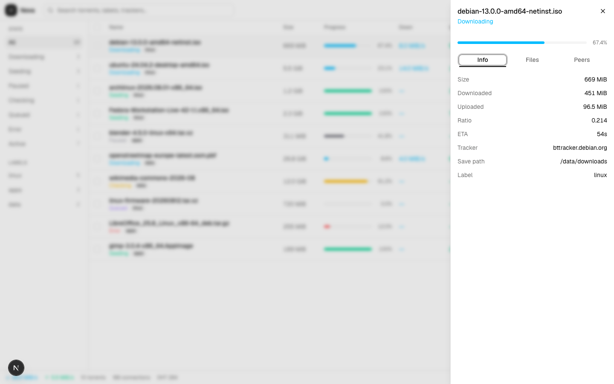
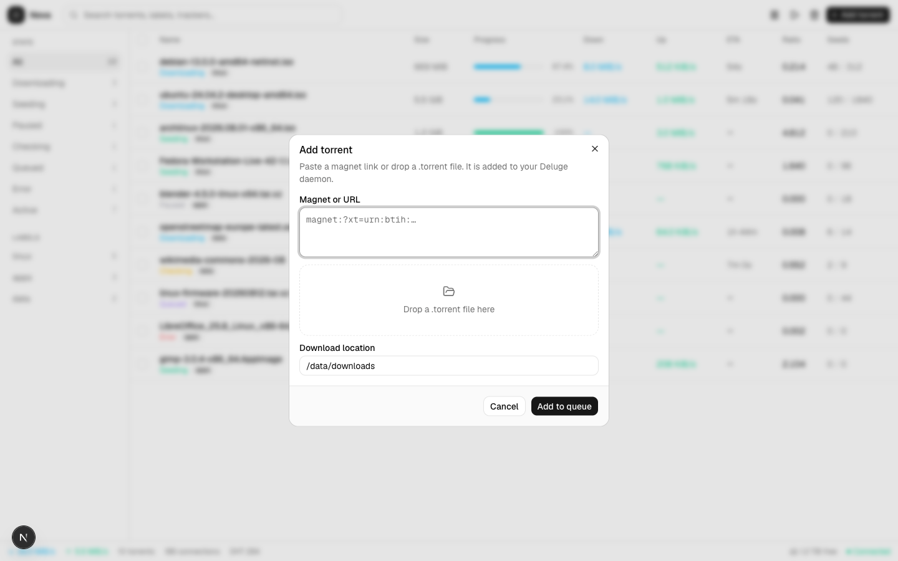

# Deluge Nova

A modern web UI for [Deluge](https://deluge-torrent.org/). Manage the queue, watch speeds, inspect files, and add magnets from a light, compact browser workspace.

<p align="center">
  
</p>

Nova is built for people who already run a Deluge daemon and want a clearer way to drive it than the stock WebUI. One screen for the queue, a side panel for details, and a status bar for the session.

## What it does

- **See the whole queue** — name, size, progress, download/upload rates, ETA, ratio, and seeds, with color-coded states
- **Filter fast** — jump by state (downloading, seeding, paused, checking, queued, error, active) or by label
- **Search** — find torrents by name, label, or tracker
- **Inspect a torrent** — transferred bytes, tracker, save path, files, and peers without leaving the list
- **Add torrents** — paste a magnet or drop a `.torrent` file, and choose where it lands
- **Watch the session** — combined rates, connections, DHT, free disk, and daemon status

## Screenshots

### Torrent details

Click a row to open info, files, and peers beside the queue.

<p align="center">
  
</p>

### Add torrent

Magnets, torrent files, and a download location.

<p align="center">
  
</p>

## Run it

```bash
npm install
npm run dev
```

Open [http://localhost:3000](http://localhost:3000).

Nova is meant to sit in front of Deluge Web and talk JSON-RPC to your daemon (`/json` and torrent upload). Keep `deluge-web` running if you want it attached to a real client.

## License

[GPL-3.0](LICENSE)
